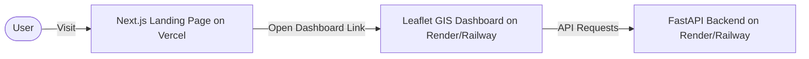

# Suraksha Deployment Guide

This guide details how to deploy the Suraksha project to cloud hosting services.

## Architecture & Connection Flow

The application consists of two deployment components:
1. **Next.js Landing Page (`frontend/`):** Deployed on **Vercel** (Static/Serverless).
2. **FastAPI Backend + Leaflet GIS Dashboard (`backend/` & `dashboard/`):** Deployed on **Render** or **Railway** (Python Service).

---

## Folder Organization

We have organized the repository to separate the components cleanly:
* `backend/` — Python FastAPI app and API services
* `dashboard/` — Static dashboard files (`index.html`, `app.js`, `styles.css`) served by FastAPI
* `frontend/` — Next.js landing page (cleaned up of vanilla assets)
* `config/`, `data/`, `ingestion/`, `models/` — Backend configuration, data directories, and pipeline execution modules

---

## Step 1: Deploying the FastAPI Backend + GIS Dashboard

You can deploy the backend using **Render** or **Railway**. The static GIS dashboard is served directly by the backend at the root path (`/`).

### Option A: Deploying on Render (Recommended)

1. **Create a Web Service:**
   * Go to [Render Dashboard](https://dashboard.render.com/) and click **New > Web Service**.
   * Connect your GitHub repository.
2. **Configuration Settings:**
   * **Name:** `suraksha-backend`
   * **Environment:** `Python`
   * **Root Directory:** (Leave empty - use project root)
   * **Build Command:** `pip install -r requirements.txt`
   * **Start Command:** `python -m uvicorn backend.main:app --host 0.0.0.0 --port $PORT`
3. **Environment Variables:**
   Add the following in the **Environment** tab:
   * `FIRECRAWL_API_KEY`: Your Firecrawl key (for search verification).
   * `PYTHONPATH`: `.`
4. **Persistent Disk (Volume):**
   * *Critical for Data Persistence:* The backend writes processed intelligence to files under `data/processed/` and `data/raw/`. Render container storage is ephemeral and gets wiped on restart/redeploy.
   * Go to the **Disks** tab of your service.
   * Click **Add Disk**:
     * **Name:** `suraksha-data`
     * **Mount Path:** `/opt/render/project/src/data` (This matches the project's root `data/` folder inside the Render worker directory).
     * **Size:** `1 GB` (More than enough for JSON snapshots).

---

### Option B: Deploying on Railway

1. **Create a New Project:**
   * Go to [Railway Dashboard](https://railway.app/) and click **New Project > Deploy from GitHub**.
   * Select your repository.
2. **Configuration Settings:**
   * In the settings, specify the **Start Command**:
     `python -m uvicorn backend.main:app --host 0.0.0.0 --port $PORT`
3. **Environment Variables:**
   * Add `PYTHONPATH` with value `.`
   * Add `FIRECRAWL_API_KEY` (if using).
4. **Persistent Volume:**
   * Go to the **Volumes** tab in your Railway service.
   * Click **Add Volume** and mount it to `/app/data` (or the folder corresponding to where your workspace files are located).

---

## Step 2: Scheduling the Ingestion Pipeline

The ingestion pipeline needs to be run periodically to fetch fresh disaster signals.

### Option A: HTTP Cron Job (e.g., cron-job.org)
Since the backend exposes a `POST /api/ingestion/run` endpoint:
1. Register on [cron-job.org](https://cron-job.org/) (Free).
2. Set up a cron job pointing to:
   `https://your-backend-url.onrender.com/api/ingestion/run`
3. Configure the schedule (e.g., every 30 minutes).

### Option B: Render Cron Job
1. In Render, click **New > Cron Job**.
2. Specify the Command: `python -m ingestion.pipeline`.
3. Set the schedule using cron syntax (e.g., `*/30 * * * *` for every 30 minutes).
4. Set the same **Persistent Disk** mount path `/opt/render/project/src/data` to ensure it writes to the shared disk used by the Web Service.

---

## Step 3: Deploying the Next.js Landing Page on Vercel

The frontend landing page is fully optimized for Vercel.

1. **Create Vercel Project:**
   * Go to [Vercel](https://vercel.com/) and import your GitHub repository.
2. **Configure Settings:**
   * **Framework Preset:** Select `Next.js`.
   * **Root Directory:** Set this to `frontend` (Very important - this tells Vercel to build only the Next.js app in the `frontend` subfolder).
3. **Configure Environment Variables:**
   * Add the following key-value pair under Environment Variables:
     * `NEXT_PUBLIC_BACKEND_URL`: `https://your-backend-url.onrender.com` (Your deployed Render/Railway backend URL).
4. **Deploy:**
   * Click **Deploy**. Vercel will build and serve the landing page!

---

## Step 4: Verification

Once both services are deployed:
1. Visit your Vercel Landing Page URL (e.g. `https://suraksha.vercel.app`).
2. Click **Open Dashboard** and check that it successfully redirects you to your Render dashboard URL (`https://suraksha-backend.onrender.com/`) and displays the Leaflet map and live incidents.
3. Check the API docs at `https://suraksha-backend.onrender.com/docs`.
